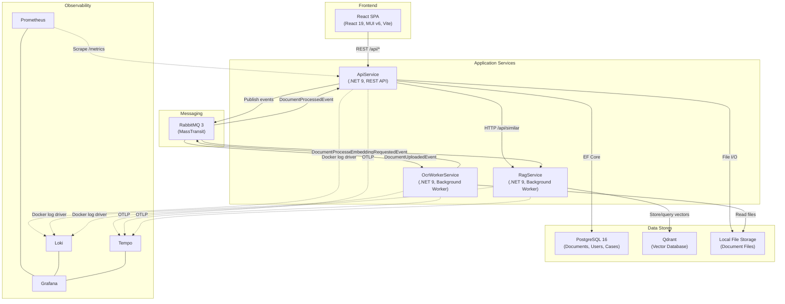
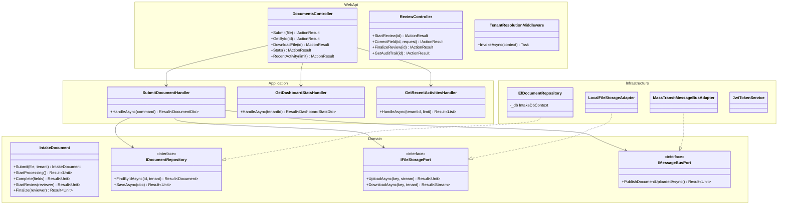
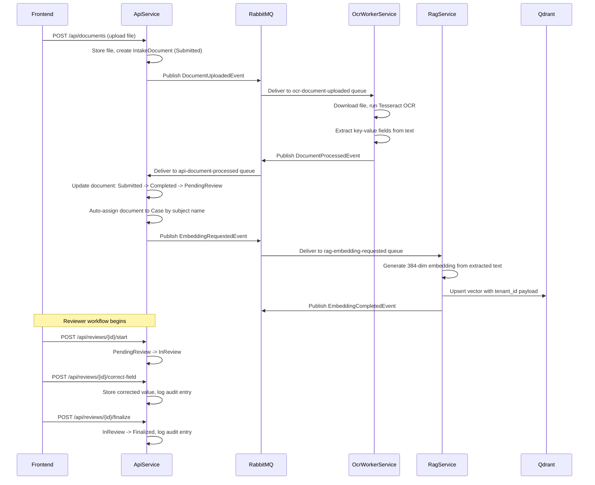
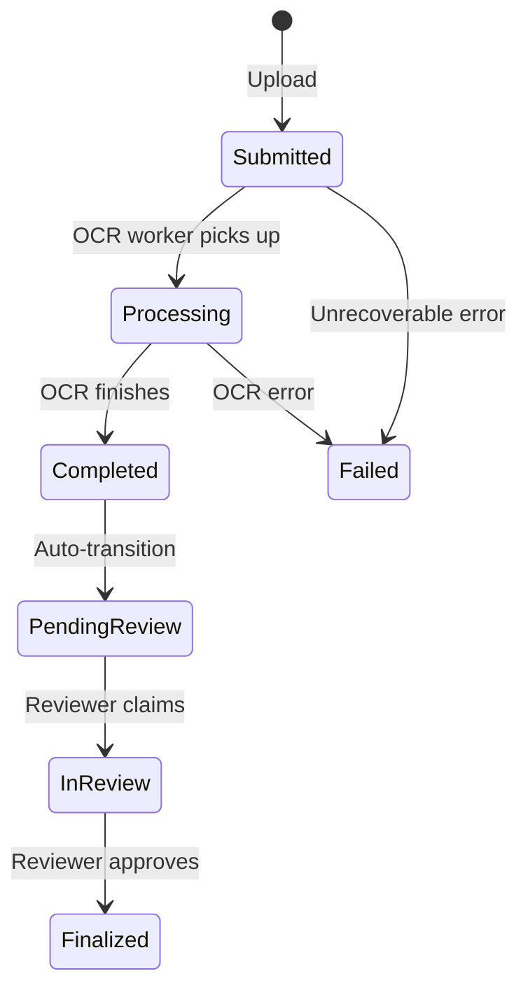
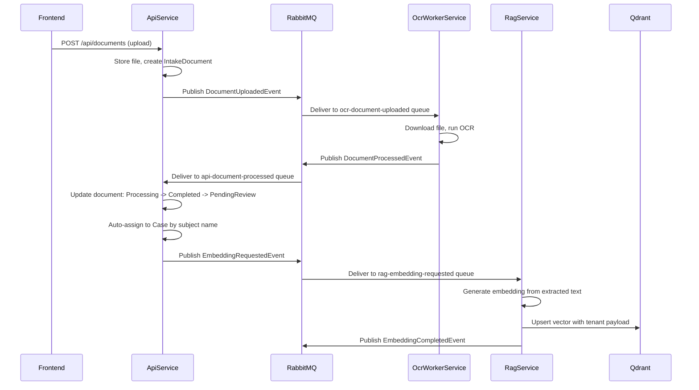

# Architecture and Rationale

This document describes the architecture of the Handwritten Intake Document Processor, a case management system that digitizes handwritten intake forms using OCR, indexes them with vector embeddings for similarity search, and provides a review workflow for human verification.

---

## Table of Contents

1. [System Architecture Overview](#system-architecture-overview)
2. [UML Component Diagram](#uml-component-diagram)
3. [Document Processing Flow](#document-processing-flow)
4. [Microservice Responsibilities and Communication](#microservice-responsibilities-and-communication)
3. [Hexagonal Architecture and DDD Patterns](#hexagonal-architecture-and-ddd-patterns)
4. [Template and Extraction Design](#template-and-extraction-design)
5. [RAG: Embedding, Chunking, and Similarity](#rag-embedding-chunking-and-similarity)
6. [Multi-Tenancy: Row-Level Isolation](#multi-tenancy-row-level-isolation)
7. [Messaging Topology](#messaging-topology)
8. [Real vs Mocked Services](#real-vs-mocked-services)
9. [Architecture Decisions and Rationale](#architecture-decisions-and-rationale)
10. [Testing Suite and Coverage](#testing-suite-and-coverage)

---

## System Architecture Overview

The following diagram shows the overall system architecture: all services, infrastructure components, and how they connect.



---

## UML Component Diagram

The ApiService follows hexagonal (ports-and-adapters) architecture. Dependencies always point inward.



---

## Document Processing Flow

End-to-end flow from document upload through OCR processing, review, and embedding.



---

## Microservice Responsibilities and Communication

### ApiService

The API gateway and primary backend. Handles all REST endpoints for the frontend:

- **Document lifecycle**: Upload, list, search, retrieve documents
- **Review workflow**: Start review, correct extracted fields, finalize review
- **Case management**: Auto-assign documents to cases by subject name, list/search cases, find similar cases via RAG
- **Authentication**: Register, login, JWT token issuance, refresh token rotation
- **Form templates**: Create and list configurable intake form templates
- **Audit trail**: Record and retrieve all actions taken on documents
- **Dashboard**: Aggregate statistics (pending review count, processed today, average processing time)

The API publishes `DocumentUploadedEvent` after storing an uploaded file. It consumes `DocumentProcessedEvent` to update document status after OCR completes and publishes `EmbeddingRequestedEvent` directly via MassTransit's `ConsumeContext` so the RagService can generate vector embeddings for similarity search.

### OcrWorkerService

A background worker that performs optical character recognition on uploaded documents.

- Consumes `DocumentUploadedEvent` from RabbitMQ
- Downloads the file from shared storage
- Runs OCR (Tesseract or mock adapter, configurable via `Ocr:Mode`)
- Extracts key-value fields from the OCR text using regex pattern matching
- Publishes `DocumentProcessedEvent` with extracted fields

The OCR worker has no REST API. It exposes only a `/health` endpoint and a Prometheus `/metrics` endpoint.

### RagService

A background worker that generates vector embeddings and provides similarity search.

- Consumes `EmbeddingRequestedEvent` from RabbitMQ
- Generates 384-dimensional embeddings (mock adapter uses SHA-256 seeded RNG; production would use OpenAI or a local model)
- Stores embeddings in Qdrant with tenant isolation via payload filtering
- Publishes `EmbeddingCompletedEvent` on success
- Exposes `GET /api/similar` and `POST /api/similar-by-text` endpoints for the API to query

### Inter-Service Communication

Services communicate exclusively through RabbitMQ (via MassTransit) for asynchronous processing and HTTP for synchronous queries (API to RAG for similarity search). There is no direct database sharing between services. The API owns the PostgreSQL schema, and the RAG service owns the Qdrant collection.

---

## Hexagonal Architecture and DDD Patterns

Each service follows the same four-layer hexagonal (ports-and-adapters) structure:

```
{Service}.Domain/          -- Entities, value objects, port interfaces
{Service}.Application/     -- Use case handlers (commands and queries)
{Service}.Infrastructure/  -- Adapters: EF Core, MassTransit, file storage
{Service}.Host or WebApi/  -- Composition root, DI registration, middleware
```

### Why Hexagonal Architecture

All business logic lives in the Domain layer. Aggregates enforce their own invariants (state transitions, validation, and tenant ownership) without any knowledge of how data is persisted or messages are dispatched. The domain layer defines port interfaces (e.g., `IDocumentRepository`, `IFileStoragePort`, `IMessageBusPort`) that infrastructure adapters implement. Infrastructure contains zero business logic; adapters only translate between domain contracts and external systems. This keeps the domain free of framework dependencies: the `IntakeDocument` aggregate does not know about EF Core, RabbitMQ, or the filesystem. The benefit is testability: every handler can be tested with hand-written test doubles that implement the same port interfaces, without spinning up databases or message brokers.

Dependencies always point inward: Infrastructure depends on Domain, never the reverse. Application depends on Domain for entities and ports. The Host/WebApi layer is the composition root that wires everything together via DI.

This strict decoupling is what enables a clean architecture approach. Because the Domain layer has no outward dependencies, it can be understood, tested, and refactored in complete isolation from delivery mechanisms and persistence details. The Application layer coordinates use cases by composing domain operations and port calls, but never contains business rules itself. Infrastructure is purely mechanical: it implements the contracts the domain defines, nothing more. The result is that each layer has a single reason to change: domain changes when business rules change, application changes when workflow orchestration changes, and infrastructure changes when external systems change. No layer bleeds into another.

### Domain-Driven Design Building Blocks

**Aggregates**: `IntakeDocument`, `Case`, `User`, `FormTemplate`, `AuditLogEntry`. Each aggregate inherits from `AggregateRoot<TId>`, which extends `Entity<TId>` with domain event support. Aggregates enforce their own invariants. For example, `IntakeDocument` enforces a strict state machine (Submitted -> Processing -> Completed -> PendingReview -> InReview -> Finalized) via `Result<T>` returns on transition methods.

**Value Objects**: `ExtractedField`, `TemplateField`, `TenantId`, `DocumentId`, `CaseId`, `UserId`, `FormTemplateId`. Value objects inherit from `ValueObject` (structural equality) or are implemented as sealed classes wrapping a `Guid`. Strongly-typed IDs prevent passing a `DocumentId` where a `CaseId` is expected.

**Domain Events**: `DocumentSubmittedEvent`, `DocumentProcessingStartedEvent`, `DocumentCompletedEvent`, `DocumentFailedEvent`, `UserRegisteredEvent`. These are raised by aggregates via `RaiseDomainEvent()` and cleared after dispatch.

**Static Factory Methods**: Aggregates use private constructors and static factory methods (`IntakeDocument.Submit(...)`, `Case.Create(...)`, `User.Register(...)`) to enforce creation invariants and raise initial domain events.

### The Result\<T\> Pattern

All port methods and handlers return `Result<T>` instead of throwing exceptions for business failures. `Result<T>` is a discriminated union: it holds either a `T` value (success) or an `Error` record (failure) with a machine-readable code and human-readable message.

```csharp
public sealed class Result<T>
{
    public bool IsSuccess { get; }
    public T Value { get; }        // throws if failure
    public Error Error { get; }    // throws if success
    public static Result<T> Success(T value) => ...;
    public static Result<T> Failure(Error error) => ...;
}
```

This eliminates null returns and exception-driven control flow for expected failures (e.g., "document not found", "invalid state transition"). Handlers check `IsSuccess`/`IsFailure` and propagate errors explicitly. The `Unit` type is used for `Result<Unit>` when there is no meaningful return value.

---

## Template and Extraction Design

### Form Templates

Form templates define the expected fields for different intake document types. The `FormTemplate` aggregate owns a collection of `TemplateField` value objects stored as a JSON column via EF Core's `OwnsMany(...).ToJson()`.

**Template types**: `ChildWelfare`, `AdultProtective`, `HousingAssistance`, `MentalHealthReferral`

**Field types**: `Text`, `Date`, `Number`, `Select`, `Checkbox`, `TextArea`. Select fields store their options as a JSON string array.

Templates are tenant-scoped and can be activated/deactivated. The frontend renders dynamic forms based on the template's field definitions.

### Field Extraction

When a document is uploaded, the API publishes a `DocumentUploadedEvent` with an optional `TemplateId`. The OCR worker processes the document and extracts fields:

- **Tesseract mode**: Runs the Tesseract CLI on the document (with PDF-to-image conversion via Docnet for PDFs). Parses the raw OCR text with a regex that matches `Key: Value` patterns on each line.
- **Mock mode**: Generates sample fields based on filename patterns (e.g., files containing "intake" get ClientName, DateOfBirth, CaseNumber, Address fields with random values and confidence scores between 0.3 and 1.0).

Extracted fields are represented as `ExtractedField` value objects with `Name`, `Value`, `Confidence`, and an optional `CorrectedValue`. The `CorrectedValue` is populated during the review workflow when a reviewer corrects an OCR extraction.

### Document State Machine



Each transition is a method on the `IntakeDocument` aggregate that returns `Result<Unit>`. Invalid transitions (e.g., trying to finalize a document that is still Submitted) return a failure result with an `INVALID_TRANSITION` error code.

---

## RAG: Embedding, Chunking, and Similarity

### Embedding Generation

The RagService generates vector embeddings for document text to enable similarity search. The current architecture uses a port/adapter pattern:

- **Port**: `IEmbeddingPort.GenerateEmbeddingAsync(string text) -> Result<float[]>`
- **Mock adapter** (current): `MockEmbeddingAdapter` produces deterministic 384-dimensional unit vectors by seeding a random number generator with a SHA-256 hash of the input text, then L2-normalizing the result. Same input always produces the same embedding.
- **Production adapter** (planned): Would call OpenAI's text-embedding-ada-002 or a local sentence-transformers model.

### Chunking Strategy

The current implementation embeds the full extracted text as a single chunk. The text content passed to the embedding port is a concatenation of the template type, subject name, and all extracted field key-value pairs. For example:

```
ChildWelfare. Emma Thompson. ChildName: Emma Thompson. Age: 7. ReasonForReferral: Educational neglect reported.
```

This works for intake documents because they are relatively short (a single page of extracted fields). If longer documents were introduced, a chunking strategy (e.g., sliding window with overlap) would be added at the `EmbedDocumentHandler` level.

### Vector Storage and Similarity Search

- **Port**: `IVectorStorePort` with `UpsertAsync`, `SearchAsync`, and `GetEmbeddingAsync`
- **Adapter**: `QdrantVectorStoreAdapter` uses the Qdrant .NET client over gRPC (port 6334)
- **Collection**: A single `documents` collection with cosine distance
- **Tenant isolation**: Each point's payload includes a `tenant_id` field. Search queries filter by tenant using Qdrant's `Must` filter condition, so tenants never see each other's documents.
- **Metadata**: Field values are stored as `meta_{key}` payload fields, enabling metadata-enriched search results.

The API service calls the RAG service's `POST /api/similar-by-text` endpoint, which generates an embedding from the query text on the fly and searches the vector store. This avoids requiring the queried document to already have a stored embedding.

### Data Seeding

In development, `RagDataSeeder` seeds 200+ synthetic case embeddings across all four template types and both demo tenants. This provides realistic similarity search results for development and demo purposes.

---

## Multi-Tenancy: Row-Level Isolation

### Design

Every data record is scoped to a tenant. `TenantId` is a strongly-typed wrapper around `Guid` that rejects `Guid.Empty` to prevent accidental use of uninitialized values.

### Tenant Resolution

1. User authenticates and receives a JWT containing a `tenant_id` claim
2. `TenantResolutionMiddleware` extracts the claim and populates a scoped `RequestTenantContext`
3. All downstream code accesses the tenant via `ITenantContext.TenantId`

Exempt paths (health checks, Swagger, auth endpoints, metrics) bypass tenant resolution.

### Database Isolation

EF Core global query filters enforce row-level isolation at the database layer:

```csharp
entity.HasQueryFilter(d =>
    _tenantContext != null &&
    _tenantContext.TenantId != null &&
    d.TenantId == _tenantContext.TenantId);
```

This filter is applied to `IntakeDocument`, `Case`, `FormTemplate`, and `AuditLogEntry`. Every query automatically includes the tenant predicate. The `Users` table does not use a global filter because auth endpoints (login, register) run before tenant context is established; tenant isolation for users is enforced explicitly in repository queries.

For background consumers that process messages without an HTTP request context, `FindByIdUnfilteredAsync` bypasses the global filter. The consumer then manually verifies the tenant from the event payload matches the document's tenant.

### Vector Store Isolation

Qdrant uses payload-based filtering. Each upserted point includes `tenant_id` in its payload, and every search query includes a `Must` filter on `tenant_id`. There is no cross-tenant data leakage because the filter is applied at the vector database level.

### Message Bus Isolation

Published messages include `TenantId` as a field in the event record. A `TenantHeaderPublishFilter` in the API service propagates tenant context as a message header for MassTransit consumers. Consumers verify tenant IDs from the message payload against the database record before processing.

---

## Messaging Topology

### Message Flow



### Queue Configuration

| Queue Name | Service | Consumer | Event |
|---|---|---|---|
| `ocr-document-uploaded` | OcrWorkerService | `DocumentUploadedConsumer` | `DocumentUploadedEvent` |
| `api-document-processed` | ApiService | `DocumentProcessedConsumer` | `DocumentProcessedEvent` |
| `rag-embedding-requested` | RagService | `EmbeddingRequestedConsumer` | `EmbeddingRequestedEvent` |

### Retry Policy

All queues use the same exponential retry configuration:

- 3 retry attempts
- Initial interval: 1 second
- Maximum interval: 30 seconds
- Interval delta (factor): 2 seconds

After all retries are exhausted, MassTransit routes the message to the corresponding `_error` queue (dead-letter).

### Message Contracts

All message contracts are defined in the shared `Messaging.Contracts` library as immutable records:

| Event | Publisher | Consumer(s) | Key Fields |
|---|---|---|---|
| `DocumentUploadedEvent` | ApiService | OcrWorkerService | DocumentId, TenantId, FileName, StorageKey, TemplateId |
| `DocumentProcessedEvent` | OcrWorkerService | ApiService | DocumentId, TenantId, ExtractedFields, ProcessedAt |
| `EmbeddingRequestedEvent` | ApiService | RagService | DocumentId, TenantId, TextContent, FieldValues |
| `EmbeddingCompletedEvent` | RagService | -- | DocumentId, TenantId, CompletedAt |

---

## Real vs Mocked Services

The system uses port/adapter interfaces throughout, making it straightforward to swap between mock and production implementations. The current state:

| Component | Port Interface | Production Adapter | Mock/Stub Adapter | Current Default |
|---|---|---|---|---|
| OCR Engine | `IOcrPort` | `TesseractOcrAdapter` (shells out to Tesseract CLI, Docnet for PDF rendering) | `MockOcrAdapter` (generates random fields with configurable patterns) | **Configurable**: `Ocr:Mode=tesseract` selects production, `mock` selects stub. Docker uses `tesseract` mode. |
| Embedding Generation | `IEmbeddingPort` | Planned: OpenAI / sentence-transformers | `MockEmbeddingAdapter` (deterministic 384-dim vectors from SHA-256 hash) | **Mock** |
| Vector Store | `IVectorStorePort` | `QdrantVectorStoreAdapter` (gRPC client to Qdrant) | N/A | **Production** (Qdrant runs in Docker) |
| File Storage | `IFileStoragePort` | Planned: Azure Blob / S3 | `LocalFileStorageAdapter` (local filesystem) | **Local filesystem** |
| Message Bus | `IMessageBusPort` | `MassTransitMessageBusAdapter` (RabbitMQ) | N/A | **Production** (RabbitMQ runs in Docker) |
| Password Hashing | `IPasswordHasher` | `BcryptPasswordHasher` (work factor 12) | N/A | **Production** |
| Token Service | `ITokenService` | `JwtTokenService` (HMAC-SHA256 signing) | N/A | **Production** |
| Case Summary | `ISummaryPort` | Planned: OpenAI / LLM-based | `TemplateSummaryAdapter` (template string builder from field metadata) | **Template-based** |
| RAG Client | `IRagServiceClient` | `HttpRagServiceClient` (HTTP to RagService) | N/A | **Production** (calls RAG service) |

To move to production, the following adapters need replacement:
1. `MockEmbeddingAdapter` with an OpenAI or local model adapter
2. `LocalFileStorageAdapter` with Azure Blob or S3
3. `TemplateSummaryAdapter` with an LLM-based summary generator

---

## Architecture Decisions and Rationale

### Why microservices instead of a monolith?

The document processing pipeline has clear bounded contexts with different scaling profiles. OCR is CPU-intensive and benefits from independent scaling. The RAG service has its own data store (Qdrant) and could be replaced or upgraded independently. The API handles user-facing traffic with different latency requirements than background processing. Splitting into three services also enables independent deployment: updating the OCR engine does not require redeploying the API.

### Why hexagonal architecture?

Hexagonal architecture was chosen to decouple business logic from infrastructure concerns. All business logic lives inside the Domain layer. Aggregates enforce their own invariants (state transitions, validation rules, tenant ownership checks) and the Application layer orchestrates use cases by calling domain methods and port interfaces. Infrastructure adapters contain zero business logic; they only translate between domain contracts and external systems (EF Core, RabbitMQ, filesystem). This separation is what makes the architecture genuinely clean: the domain can be developed, tested, and reasoned about without knowing whether data lives in PostgreSQL or an in-memory dictionary, and without knowing whether messages flow through RabbitMQ or a direct method call. Each layer changes for exactly one reason: business rules change the domain, workflow changes touch the application layer, and technology changes affect only infrastructure. The primary benefit is testability: every handler in the Application layer can be tested with hand-written in-memory test doubles that implement the port interfaces. No database, no message broker, no file system needed for unit tests. The secondary benefit is portability: swapping from local file storage to Azure Blob requires changing only the adapter registration in the composition root, not any business logic.

### Why DDD with aggregates and value objects?

The domain has genuine complexity: documents go through a multi-step state machine, fields can be corrected during review, cases group related documents, and all of this must respect tenant boundaries. DDD aggregates enforce invariants at the domain level. The `IntakeDocument` aggregate prevents invalid state transitions regardless of which adapter or handler is calling it. Value objects like `ExtractedField` and `TenantId` provide structural equality and type safety.

### Why Result\<T\> instead of exceptions?

Business failures (document not found, invalid state transition, field not found) are expected outcomes, not exceptional conditions. Using exceptions for control flow obscures the actual failure paths and makes it hard to ensure all callers handle errors. `Result<T>` forces callers to explicitly check for failure, and the `Error` record provides both a machine-readable code (for switch/matching) and a human-readable message (for logging/display).

### Why strongly-typed IDs?

Passing raw `Guid` values around is error-prone: nothing prevents passing a document ID where a case ID is expected. `DocumentId`, `CaseId`, `UserId`, `FormTemplateId`, and `TenantId` are distinct types that catch misuse at compile time. They also reject `Guid.Empty` to prevent accidental use of default/uninitialized values.

### Why MassTransit over raw RabbitMQ?

MassTransit provides consumer abstraction, message retry with exponential backoff, dead-letter handling, message serialization, and OpenTelemetry integration out of the box. Raw RabbitMQ would require implementing all of this manually. MassTransit also supports swapping transports (e.g., to Azure Service Bus or Amazon SQS) without changing consumer code.

### Why EF Core global query filters for tenant isolation?

Global query filters provide defense-in-depth for multi-tenancy. Even if a developer forgets to add a `WHERE tenant_id = @tenantId` clause, the global filter ensures no cross-tenant data is returned. This is a safety net, not the only line of defense. Repositories also take `TenantId` as an explicit parameter.

### Why hand-written test doubles instead of mocking frameworks?

Hand-written test doubles (sealed inner classes implementing port interfaces) are explicit, readable, and do not depend on reflection-based mocking libraries. They make test behavior obvious: you can read the fake implementation and understand exactly what it returns. They also avoid the pitfalls of over-mocking, where tests become tightly coupled to implementation details.

### Why FluentValidation with a global filter?

The default ASP.NET model binding validation returns 400 with a format that does not match the `ApiResponse<T>` envelope. FluentValidation with a custom `ValidationFilter` returns 422 with `VALIDATION_ERROR` code and field-level `Details`, which the frontend can map directly to per-field inline error messages. This provides a consistent error contract across all endpoints.

### Why a shared Messaging.Contracts library?

Message contracts are the API boundary between services. Putting them in a shared library ensures type safety: publishers and consumers compile against the same record definitions. Breaking changes to a message contract cause compile errors in both the publisher and consumer, which is caught before deployment.

### Why PostgreSQL JSON columns for extracted fields and template fields?

`ExtractedField` and `TemplateField` are owned collections that belong to their parent aggregate. Storing them as JSON columns (via EF Core's `OwnsMany(...).ToJson()`) keeps the data model simple: no separate tables, no joins, no orphan cleanup. The tradeoff is that you cannot query individual fields efficiently with SQL, but the system does not need to. Fields are always loaded and saved as part of their parent aggregate.

---

## Testing Suite and Coverage

### Test Projects

| Test Project | Scope | Test Count | What It Tests |
|---|---|---|---|
| `SharedKernel.Tests` | Unit | 42 | `Entity<T>`, `ValueObject`, `AggregateRoot<T>`, `Result<T>`, `TenantId`, `DomainEvent`, `AppMetrics`, `ServiceDiagnostics` |
| `Api.Domain.Tests` | Unit | 66 | `IntakeDocument` state machine, `Case`, `User`, `FormTemplate`, `ExtractedField`, `AuditLogEntry`, `FormTemplateId` |
| `Api.Application.Tests` | Unit | 111 | All command and query handlers: Submit, Review, Correct, Finalize, Login, Register, Search, Dashboard, RecentActivities, SimilarCases, AuditTrail |
| `Api.Infrastructure.Tests` | Integration | 39 | EF Core repositories (in-memory SQLite), tenant isolation, cross-tenant isolation, `BcryptPasswordHasher`, `JwtTokenService`, `LocalFileStorageAdapter`, `HttpRagServiceClient`, `TemplateSummaryAdapter` |
| `Api.WebApi.Tests` | Unit | 148 | Controllers (Auth, Documents, Cases, Review, FormTemplates), `TenantResolutionMiddleware`, `ValidationFilter`, all FluentValidation validators, `ApiResponse<T>`, Swagger contract tests |
| `Messaging.Tests` | Unit | 23 | `MassTransitMessageBusAdapter`, all three consumers (`DocumentProcessedConsumer`, `DocumentUploadedConsumer`, `EmbeddingRequestedConsumer`), `TenantHeaderPublishFilter`, contract serialization |
| `OcrWorker.Tests` | Unit | 19 | `ProcessDocumentHandler`, `MockOcrAdapter`, `TesseractOcrAdapter`, `LocalFileStorageReadAdapter`, consumer log scopes |
| `RagService.Tests` | Unit | 26 | `EmbedDocumentHandler`, `SimilarDocumentsHandler`, `FindSimilarByTextHandler`, `MockEmbeddingAdapter`, `EmbeddingRequestedConsumer`, `RagDataSeeder` |
| **Frontend** (Vitest) | Unit | ~10 | Auth store (`authStore.test.ts`), utility functions (`index.test.ts`), JWT parsing (`jwt.test.ts`), validation (`validation.test.ts`) |

**Total backend tests**: ~486 `[Fact]` tests across 8 test projects.

### Testing Approach

- **Framework**: xUnit with `[Fact]` assertions and `Assert.*` methods
- **Test doubles**: Hand-written sealed inner classes implementing port interfaces. No Moq or other mocking frameworks.
- **Logging**: `NullLogger<T>` for all tests that require an `ILogger<T>` parameter
- **Naming convention**: Test methods use `snake_case` with descriptive names (e.g., `marks_document_completed_with_extracted_fields`)
- **Infrastructure tests**: Use EF Core's in-memory SQLite provider for repository tests, verifying tenant isolation and query filter behavior
- **Messaging tests**: Verify consumer behavior by calling `Consume()` directly with constructed `ConsumeContext` wrappers, asserting on repository state changes and published messages
- **Contract tests**: Verify that message contract records can round-trip through JSON serialization without data loss

### Coverage Areas

- All domain aggregate invariants (state transitions, validation, factory methods)
- All command and query handlers (success and failure paths)
- Tenant isolation at the database layer (global query filters, cross-tenant rejection)
- JWT token generation and validation
- Password hashing and verification
- File storage operations
- Input validation for all request DTOs
- Controller routing and response mapping
- Middleware behavior (tenant resolution, authentication checks, exempt paths)
- Message consumer processing (field mapping, status transitions, error handling)
- Message contract serialization compatibility
